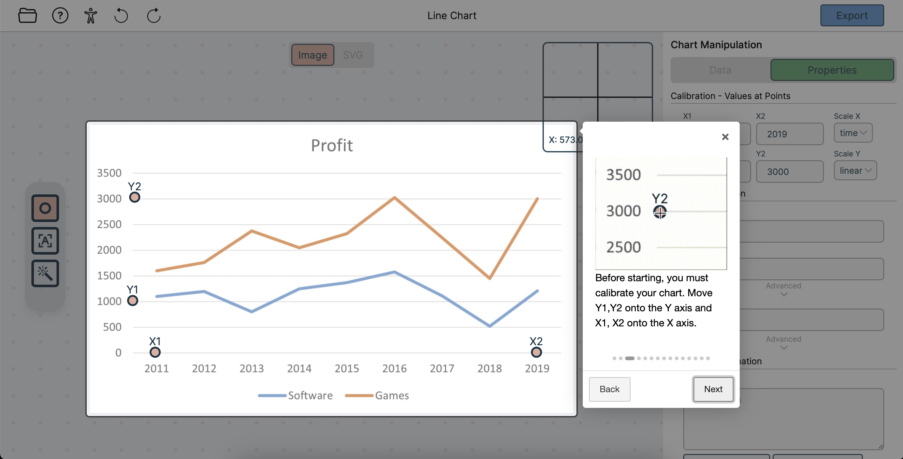

# Table of Contents

1. [Chart4Blind](#Chart4Blind)
2. [Features](#features)
3. [Screenshots](#screenshots)
4. [Project Setup-Guide](#project-setup-guide)
5. [Usage as developer](#usage-as-developer)
6. [Distribute](#distribute)
7. [Running Tests](#running-tests)
8. [Authors](#authors)

# Chart4Blind
The importance of equal opportunity when it comes to interaction with digital media is important in the
educational field. While the goal should be to make documents accessible in creation, retrospectively
making documents accessible is of equal importance. Accessible doc at ACCESS takes a PDF and classifies
various sections into their respective types. The “chart” class is what this project will focus on.

After inputting an image, the user is taken to the User Interface of Chart2SVG. The intended output of the tool,
which is achieved through a semi-autonomous approach, is an SVG or a CSV. The interface currently supports line charts 
as a proof-of-concept. They can then either use the manual tool to input data-points or the automatic detection tool. 
The automatic detection tool only requires a simple click process on one of the lines to add it to the working-set.
Using a drop-down, multiple lines can be input simultaneously. 


## Features

- A user is provided tools to convert an input image of a Line Chart
- Manual Input of Data Points on Chart
- Automatic Input of Data Points on Chart
- SVG and CSV output
- OCR tool for Labels, Axis and descriptions entry
- Guided tour
- snackbar for feedback
- SVG and CSV stored on server as training data if consent given

## Screenshots





## Project Setup-Guide
IMPORTANT: For automatic detection to work, a LineFormer equivalent backend must be running that accepts images [LineFormer](https://github.com/TheJaeLal/LineFormer). 
See axiosRequests.ts. Alter this interface, and possibly the proxy in package.json, to provide the required data to the tool.

Clone this project into a directory of choice:
Download and install **node** and **npm** through their website [NodeJS](https://nodejs.org/en/download/)
or other means. 
Then, run the command
```bash
  npm install
```
from the project root to install dependencies.

## Usage as Developer
To run this project locally (dev move), run the command:
```bash
  npm start
```
This will open the browser with the running dev instance.

## Distribute
To build this project run 
```bash
  npm run build
```

## Running Tests
To run all tests, run the following command
```bash
  npm run test
```
This creates a coverage directory with an icov-report. 
View this report by opening the index.html file created in the coverage directory.

## Authors
- Morris Baumgarten-Egemole
- Supervised by: Omar Moured and Dr. Thorsten Schwarz
